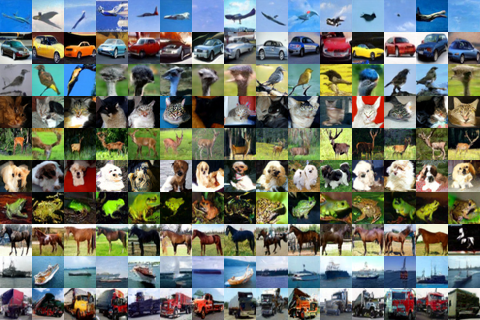

# DDPM

A PyTorch implementation of [Denoising Diffusion Probabilistic Models](https://arxiv.org/abs/2006.11239).

Here are some images generated by the model trained on CIFAR-10, using [classifier-free guidance](https://arxiv.org/abs/2207.12598) and [cosine scheduling](https://arxiv.org/abs/2102.09672):



My objective was only to generate images. If you're looking for a more comprehensive implementation, I suggest taking a look at [this codebase](https://github.com/openai/improved-diffusion). 

The reference that helped me the most by far was [What are diffusion models?](https://lilianweng.github.io/posts/2021-07-11-diffusion-models/), by Lilian Weng.

#### Dependencies:

- numpy
- pytorch
- pytorch lightning
- wandb
- [einops](https://einops.rocks/)
- pyyaml

## References


```bibtex
@article{ho2020denoising,
  title   = {Denoising Diffusion Probabilistic Models},
  author  = {Jonathan Ho and Ajay Jain and Pieter Abbeel},
  year    = {2020},
  journal = {arXiv preprint arxiv:2006.11239}
}
```

```bibtex
@article{weng2021diffusion,
  title   = "What are diffusion models?",
  author  = "Weng, Lilian",
  journal = "lilianweng.github.io",
  year    = "2021",
  month   = "Jul",
  url     = "https://lilianweng.github.io/posts/2021-07-11-diffusion-models/"
}
```
```bibtex
@misc{ho2022classifierfreediffusionguidance,
  title         = {Classifier-Free Diffusion Guidance}, 
  author        = {Jonathan Ho and Tim Salimans},
  year          = {2022},
  eprint        = {2207.12598},
  archivePrefix = {arXiv},
  primaryClass  = {cs.LG},
  url           = {https://arxiv.org/abs/2207.12598}, 
}
```
```bibtex
@misc{nichol2021improveddenoisingdiffusionprobabilistic,
  title         = {Improved Denoising Diffusion Probabilistic Models}, 
  author        = {Alex Nichol and Prafulla Dhariwal},
  year          = {2021},
  eprint        = {2102.09672},
  archivePrefix = {arXiv},
  primaryClass  = {cs.LG},
  url           = {https://arxiv.org/abs/2102.09672}, 
}
```